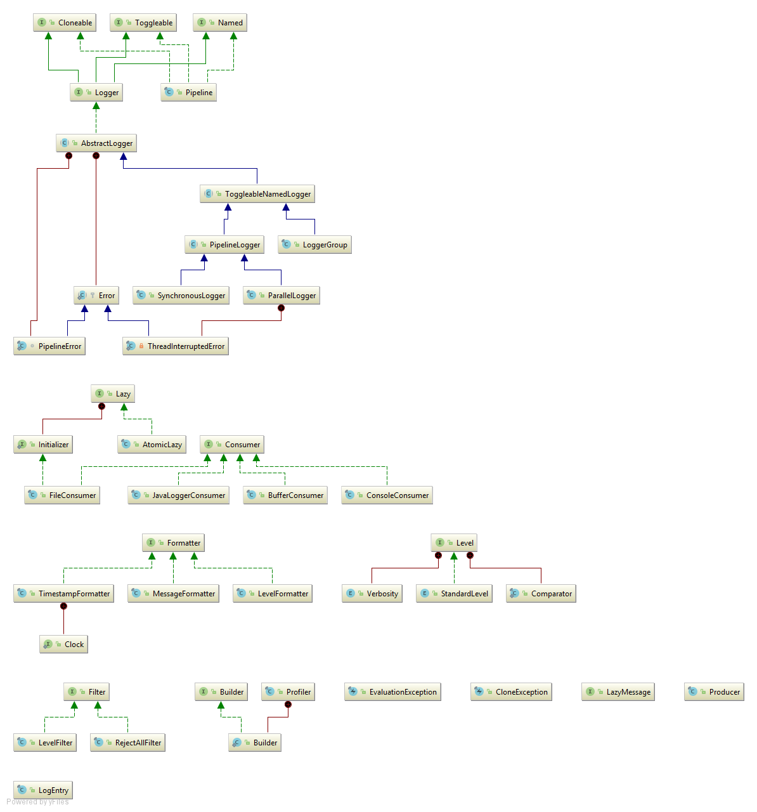

## Features

- A clear interface enables greater extensibility.
- Configuration is done at compile-time. XML is not supported; instead, you are free to implement customization how you want it.
- Either pass `Logger` instances to constructors or use dependency injection.
  No per-class static constants referencing the logger object.
- Do work in another thread, to avoid blocking the current one
- Do work in parallel
- Thread-safety is provided out-of-the-box and required by all contracts.

## Download

All artifacts contain the source code.  
They are available for download in the *Releases* section of this repository, via Maven or Gradle.  
When using a build tool, make sure to add [@MrSystem](https://github.com/MrSystem)'s repository:

**Maven**

```xml
<repository>
  <id>github.com/MrSystem</id>
  <url>https://cdn.fmenza.it/maven</url>
</repository>
```

**Gradle**

```groovy
maven {
    url 'https://cdn.fmenza.it/maven'
}
```

Find coordinates for specific versions in the *Releases* section of this repository.

The rest of this document applies to the latest revision of version **1**.

---

Java 8 is required.  
The automatic module name is `it.menzani.logger`.

## Package structure

Domain-specific classes can be found in two packages:
- `it.menzani.logger.api`
- `it.menzani.logger.impl`

The `it.menzani.logger` package contains three facilities which can be used freely:
- A `Builder<T>` interface
- Lazy initialization done well
- Profiler to measure code execution time

Also, the `it.menzani.logger.api.Cloneable<T>` interface provides a straightforward alternative to Java's cloning mechanism.

## Class hierarchy



<sub>[UML diagram](Logger.uml)</sub>

## Tutorial

### Hello World

```java
Logger logger = new SynchronousLogger()
        .addPipeline(new Pipeline()
                .addConsumer(new ConsoleConsumer()));
logger.info("Hello, world!");
```

### A more advanced example

```java
Logger logger = new LoggerGroup()
        .addLogger(new SynchronousLogger()
                .addPipeline(new Pipeline()
                        .setDefaultVerbosity()
                        .addConsumer(new JavaLoggerConsumer(java.util.logging.Logger.getGlobal()))))
        .addLogger(new ParallelLogger()
                .addPipeline(new Pipeline()
                        .setVerbosity(StandardLevel.WARNING)
                        .setProducer(new Producer()
                                .append('[')
                                .append(new TimestampFormatter())
                                .append(' ')
                                .append(new LevelFormatter())
                                .append("] ")
                                .append(new MessageFormatter()))
                        .addConsumer(new ConsoleConsumer())
                        .addConsumer(new FileConsumer(Paths.get("important.log"))))
                .setDefaultParallelism());
logger.fine(() -> "There are " + Runtime.getRuntime().availableProcessors() + " logical processors.");
logger.throwable(new Exception(), "An exception was thrown.");
```

## Project

Work is ongoing to produce version 2, which will feature parameterized messages, a `RotatingFileConsumer`, and more.  
If you like this project, and use it in production, [let me know](mailto:dev@fmenza.it).